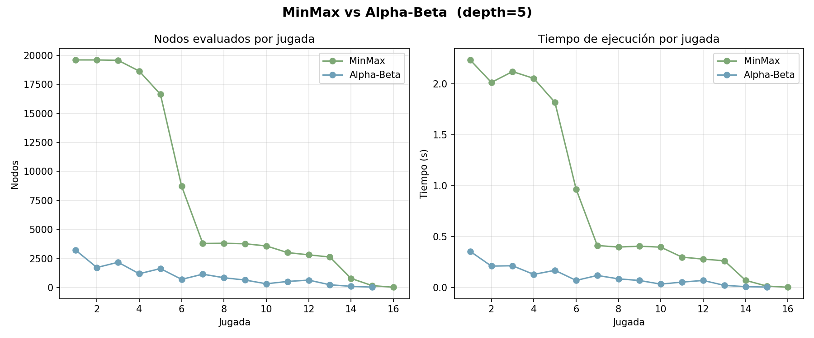

# Conecta 4 — MinMax & Alpha-Beta

Proyecto de **Estructura de Datos** (Prof. Didier Gamboa Angulo).  
Implementación de Conecta 4 con inteligencia artificial basada en los algoritmos **MinMax** y **Alpha-Beta Pruning**, con métricas comparativas en tiempo real.

## **[Demo](https://bylev.github.io/Conecta4_MinMax_AlphaBeta/)**

---

## Versiones

| Versión | Cómo ejecutarla | Descripción |
|---------|----------------|-------------|
| **Estática** | [GitHub Pages](https://bylev.github.io/Conecta4_MinMax_AlphaBeta/) | Sin instalación, corre directo en el navegador |
| **Web (Flask)** | `python connect4/app.py` | Tablero visual, gráficas interactivas al terminar la partida |
| **Terminal** | `python connect4/main.py` | CLI, genera `resultados.png` con matplotlib al finalizar |

---

## Modos de juego

- **Jugador vs. IA** — el humano juega contra Alpha-Beta (depth 5); cada jugada muestra métricas de ambos algoritmos corriendo en paralelo.
- **IA vs. IA** — MinMax (X) enfrenta a Alpha-Beta (O) con la misma profundidad. Al terminar se grafican los nodos evaluados y el tiempo por jugada.

En la versión estática también puedes enfrentar **Alpha-Beta vs. Alpha-Beta**.

---

## Algoritmos

### MinMax
Explora el árbol de búsqueda completo hasta la profundidad configurada (`depth = 5`). Garantiza la jugada óptima pero visita todos los nodos posibles.

### Alpha-Beta Pruning
Produce el mismo resultado que MinMax pero **poda las ramas** donde `α ≥ β`, evitando explorar caminos que no pueden mejorar el resultado actual. Reduce hasta un 70 % los nodos evaluados.

### Función de evaluación
Puntúa ventanas de 4 celdas en horizontal, vertical y diagonal:

| Condición | Puntos |
|-----------|--------|
| 4 fichas propias | +100 |
| 3 fichas + 1 vacía | +5 |
| 2 fichas + 2 vacías | +2 |
| 3 fichas rivales + 1 vacía | −4 |

Adicionalmente premia el control de la columna central (+3 por ficha).

---

## Métricas

Cada jugada de la IA registra:

- **Nodos evaluados** — cuántos estados del tablero se exploraron
- **Tiempo de ejecución** — segundos que tardó el algoritmo
- **Reducción (%)** — `(1 - nodos_AB / nodos_MM) × 100`

En la versión web las gráficas aparecen en la pantalla de inicio tras terminar la partida.  
En la versión terminal se guarda `resultados.png`:



---

## Instalación y uso

```bash
# Clonar el repositorio
git clone https://github.com/bylev/Conecta4_MinMax_AlphaBeta.git
cd Conecta4_MinMax_AlphaBeta

# Instalar dependencias
pip install flask matplotlib

# Versión terminal
python connect4/main.py

# Versión web
python connect4/app.py
# Abrir http://localhost:5000
```

---

## Estructura del proyecto

```
connect4/
  ai.py          # MinMax, Alpha-Beta, función de evaluación
  game.py        # Lógica del tablero (6 × 7)
  metrics.py     # Cronómetro y comparación de algoritmos
  main.py        # CLI + plot con matplotlib
  app.py         # API REST con Flask
templates/       # HTML de la versión Flask
static/          # JS y CSS de la versión Flask
docs/            # Versión estática (GitHub Pages)
```

---

## *Nota*: Página html creada con ayuda de Claude Code para una mejor interfaz.

*Conecta 4 — Michelle Cámara · Tecnológico de Software · Estructura de Datos*
